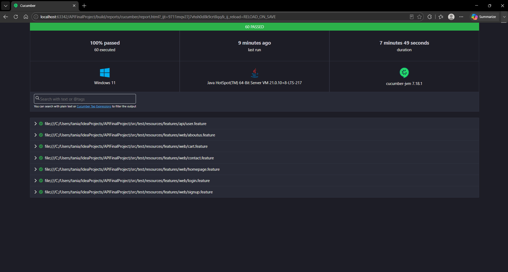

# Final Project - Web UI & API Automation Testing

## Overview

This project is an Automation Testing Framework developed using Java, Selenium WebDriver, Rest Assured, Cucumber, and Gradle.

The framework covers both:

- Web UI Automation Testing
- API Automation Testing

within a single repository following Behavior Driven Development (BDD) using Gherkin syntax and Cucumber.

---

## Technology Stack

| Tools | Description |
|---------|------------|
| Java | Programming Language |
| Selenium WebDriver | Web UI Automation |
| Rest Assured | API Automation |
| Cucumber | BDD Framework |
| JUnit | Test Runner |
| Gradle | Build Tool |
| GitHub Actions | Continuous Integration |
| ChromeDriver | Browser Automation |

---

## Application Under Test

### Web UI

https://www.demoblaze.com/

### API

https://dummyapi.io/

### Authentication Header

```text
app-id: 63a804408eb0cb069b57e43a
```

---

## Project Structure

```text
FinalProject
├── .github
│   └── workflows
│       └── automation.yml
│
├── src
│   └── test
│       ├── java
│       │   ├── api
│       │   │   ├── client
│       │   │   │   └── UserClient.java
│       │   │   ├── stepdef
│       │   │   │   └── UserSteps.java
│       │   │   └── utils
│       │   │       └── BaseAPI.java
│       │   │
│       │   ├── runner
│       │   │   └── Test.java
│       │   │
│       │   └── web
│       │       ├── page
│       │       │   ├── AboutUsPage.java
│       │       │   ├── CartPage.java
│       │       │   ├── ContactPage.java
│       │       │   ├── HomePage.java
│       │       │   ├── LoginPage.java
│       │       │   └── SignupPage.java
│       │       │
│       │       └── stepdef
│       │           ├── AboutUsSteps.java
│       │           ├── BaseTest.java
│       │           ├── CartSteps.java
│       │           ├── ContactSteps.java
│       │           ├── HomePageSteps.java
│       │           ├── Hooks.java
│       │           ├── LoginSteps.java
│       │           └── SignupSteps.java
│       │
│       └── resources
│           └── features
│               ├── api
│               │   └── user.feature
│               │
│               └── web
│                   ├── aboutus.feature
│                   ├── cart.feature
│                   ├── contact.feature
│                   ├── homepage.feature
│                   ├── login.feature
│                   └── signup.feature
│
├── .gitignore
├── build.gradle
├── gradlew
├── gradlew.bat
├── settings.gradle
└── README.md
```

---

## Project Structure Description

### api

Contains API automation components:

- client: API request implementation
- stepdef: Cucumber step definitions
- utils: API configuration and reusable utilities

### web

Contains Web UI automation components:

- page: Page Object Model (POM) classes
- stepdef: Cucumber step definitions and test setup

### features

Contains feature files written in Gherkin syntax:

- api: API test scenarios
- web: Web UI test scenarios

### runner

Contains the Cucumber test runner configuration.

---

## Web UI Automation

### Framework Design Pattern

This framework uses the Page Object Model (POM) design pattern to separate:

- Locators
- Actions
- Assertions

This approach improves readability, maintainability, and reusability of test scripts.

### Web Automation Scenarios

The automated test scenarios cover the main functionalities available on the Demoblaze website, including:

- Homepage
- Signup
- Login
- Cart
- Contact
- About Us

---

## API Automation

### API Automation Scenarios

#### Tag API

- Get List of Tags

#### User API

- Get User List
- Create User
- Get User By ID
- Verify User Response Contains Required Fields
- Update User
- Delete User

#### Negative Testing

- Access endpoint without app-id

---

### API Validation

The framework validates:

- Status Codes
- Response Body
- Response Fields
- Response Data
- CRUD Operations
- Authorization

---

## Running Tests

### Run All Tests

Execute all Web UI and API automation scenarios:

```bash
./gradlew test
```

---

## GitHub Actions

This project includes CI/CD automation using GitHub Actions.

### Trigger Events

- Manual Trigger (`workflow_dispatch`)
- Pull Request (`pull_request`)

### Workflow Process

1. Checkout source code
2. Setup Java environment
3. Build project
4. Execute automation tests
5. Generate reports

---

## Test Report

Sample execution report:



---

## Author

**Tania Syawaliyah Putri**

Final Project - QA Automation Engineer